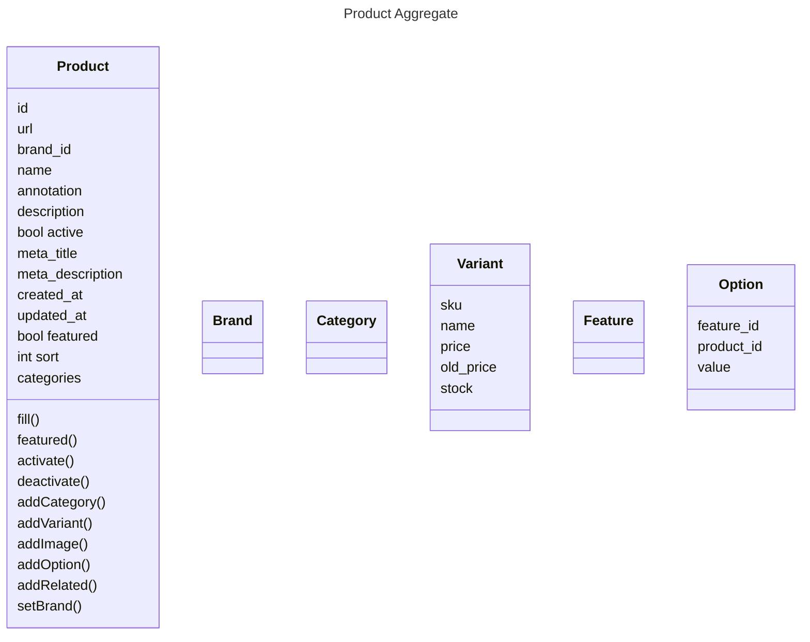
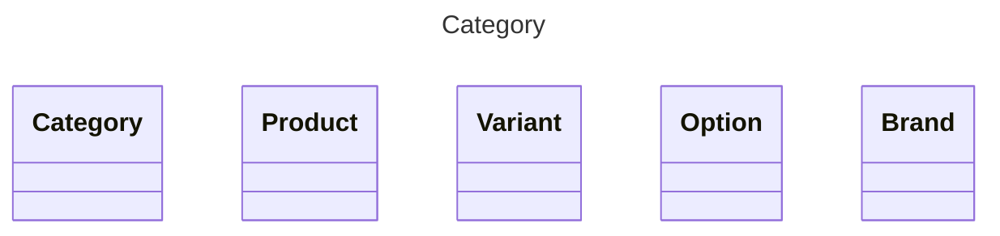

```mermaid
---
title: Product Aggregate
---
classDiagram
    class Product {
        id
        url
        brand_id
        name
        annotation
        description
        bool active
        meta_title
        meta_description
        created_at
        updated_at
        bool featured
        int sort
        categories
        fill()
        featured()
        activate()
        deactivate()
        addCategory()
        addVariant()
        addImage()
        addOption()
        addRelated()
        setBrand()
    }
    class Brand {
    }
    class Category {
    }
    class Variant {
        sku
        name
        price
        old_price
        stock
    }
    class Feature {
        
    }
    class Option {
        feature_id
        product_id
        value
    }
```

```mermaid
---
title: Category
---
classDiagram
    class Category {
    }
    class Product {
    }
    class Variant {
    }
    class Option {
    }
    class Brand {
    }
```
