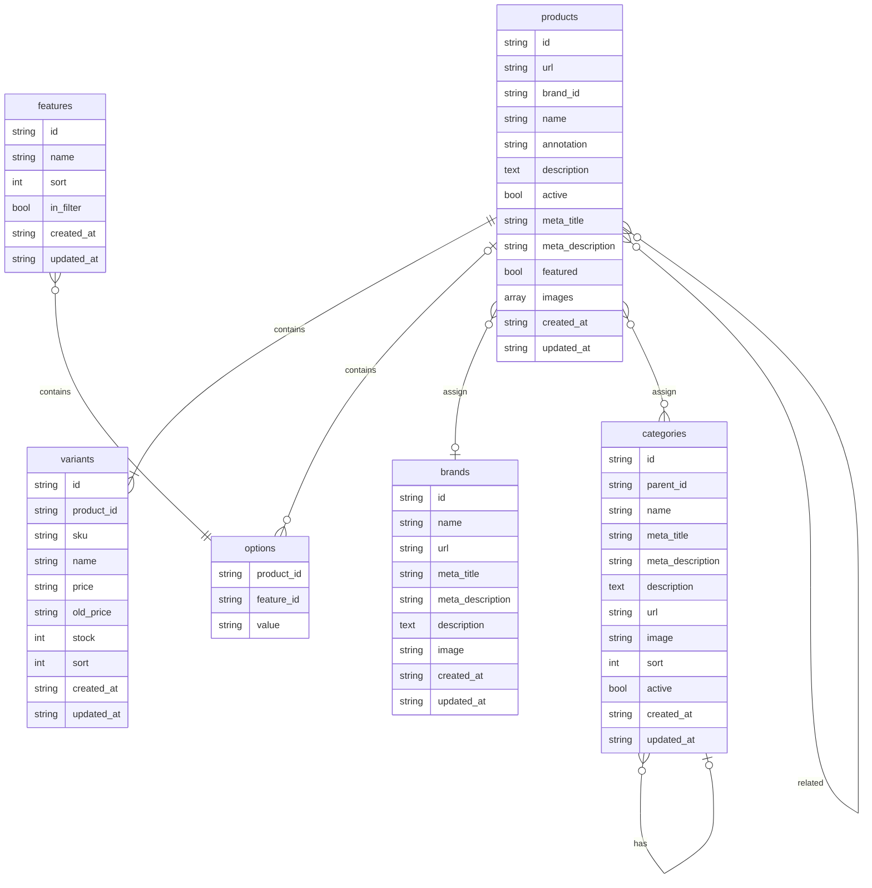

```mermaid
erDiagram
    products ||--|{ variants: contains
    products |o--o{ options: contains
    products }o--o| brands: assign
    products }o--o{ categories: assign
    products }o--o{ products: related
    categories }o--o| categories: has
    features }o--|| options: contains

    brands {
        string id
        string name
        string url
        string meta_title
        string meta_description
        text description
        string image
        string created_at
        string updated_at
    }
    
    products {
        string id
        string url
        string brand_id
        string name
        string annotation
        text description
        bool active
        string meta_title
        string meta_description
        bool featured
        array images
        string created_at
        string updated_at
    }

    variants {
        string id
        string product_id
        string sku
        string name
        string price
        string old_price
        int stock
        int sort
        string created_at
        string updated_at
    }

    features {
        string id
        string name
        int sort
        bool in_filter
        string created_at
        string updated_at
    }

    options {
        string product_id
        string feature_id
        string value
    }
    
    categories {
        string id
        string parent_id
        string name
        string meta_title
        string meta_description
        text description
        string url
        string image
        int sort
        bool active
        string created_at
        string updated_at
    }

```
